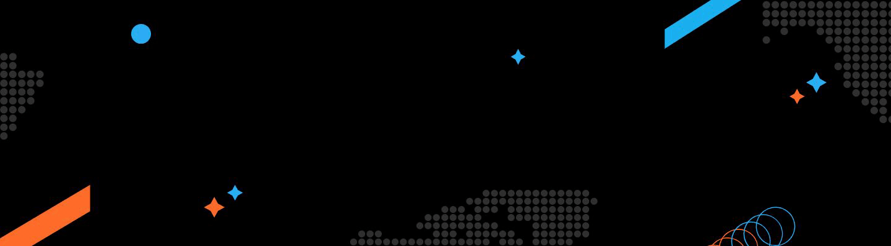

<h1>About me</h1>

<b>I am a front-end developer with a passion for learning something new every day.</b>

My core interest is JavaScript and I currently focus on React and React Native mobile projects. When I write a code, I analyze, adapt and overcome. I don’t mind an improvisation if that leads to thinking out-of-the-box for transforming a business idea into a viable product. My experience in working with ERP software and hosting services allow me to tackle challenges with the user and client-centric approach. I value teamwork and follow agile model when working on projects.

<h1>Technologies</h1>

    
    
    
    
     
     
     

<h1>Connect with me</h1>

  

 

<h1>My stats</h1>

    
    

<h1>Blog posts</h1>

- <a href="https://selleo.com/blog/why-choose-react-native-for-your-mobile-tech-stack">Why Choose React Native For Your Mobile Tech Stack?</a>
- <a href="https://selleo.com/blog/react-native-vs-flutter-the-ultimate-comparison">React Native vs Flutter: The Ultimate Comparison</a>
- <a href="https://selleo.com/blog/mobile-software-development-trends-to-know-in-2021">Mobile Software Development Trends To Know In 2021</a>

<h1>My projects</h1>

- <a href="https://selleo.com/portfolio/messaging-mobile-application">Sample project</a>
